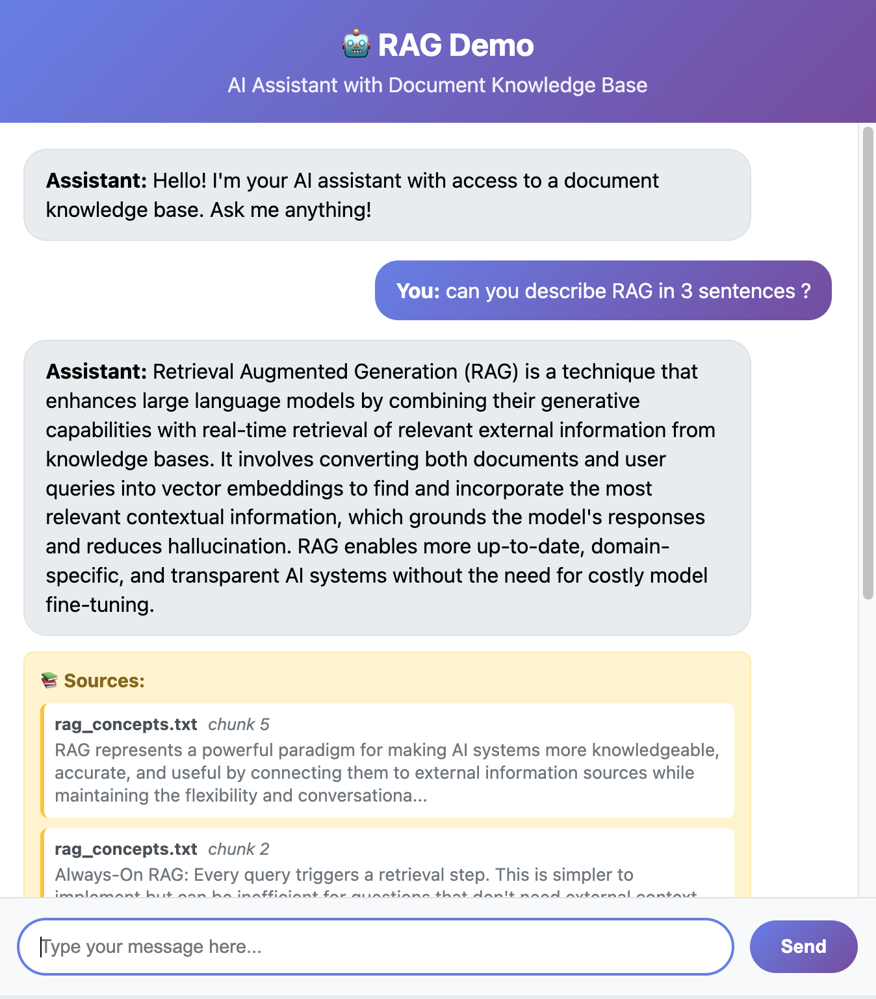

# RAGデモ - 教育用実装

教育目的のためのミニマルなRAG（Retrieval Augmented Generation）実装です。以下の機能を含みます：

- 🤖 AIアシスタントチャットインターフェース
- 🔍 ツール呼び出しによるRAGドキュメント検索
- 📚 ChromaDBベクトルデータベース
- ⚡ FastAPIバックエンド
- 🎨 シンプルなHTML/CSS/JSフロントエンド
- 🔧 GPT-4.1 Mini統合

**[NEWTYPE K.K.](https://newtypekk.com)の[Davide Pasca](https://github.com/dpasca)により開発**



## クイックセットアップ

**オプション1: 自動セットアップ（推奨）**
```bash
# Linux/Mac
./setup.sh

# Windows
setup.bat
```

**オプション2: 手動セットアップ**

1. **仮想環境の作成とアクティベート:**
   ```bash
   # 仮想環境を作成
   python -m venv venv

   # 仮想環境をアクティベート
   # Linux/Mac:
   source venv/bin/activate
   # Windows:
   venv\Scripts\activate
   ```

2. **依存関係のインストール:**
   ```bash
   pip install -r requirements.txt
   ```

3. **環境変数の設定:**
   - `.env.example`を`.env`にコピーし、OpenAI APIキーを追加:
   ```bash
   cp .env.example .env
   # .envを編集してOpenAI APIキーを追加
   ```

4. **RAGデータベースの初期化:**
   ```bash
   python update_rag.py
   ```

5. **サーバーの起動:**
   ```bash
   python main.py
   ```

6. **ブラウザでアクセス:**
   `http://localhost:8000`にアクセス

> **注意**: 自動セットアップスクリプトは仮想環境の作成、依存関係のインストール、`.env`ファイルの設定を自動で行います。OpenAI APIキーを`.env`ファイルに追加するだけで完了です。

## 使用方法

### チャットインターフェース
- ウェブインターフェースで質問を入力
- 関連する場合、AIが自動的にドキュメントを検索
- RAGが使用された際にソースが表示される

### ドキュメントの追加
- `documents/`フォルダに`.txt`ファイルを配置
- `python update_rag.py`を実行してデータベースを更新
- ドキュメントは設定可能なサイズ/オーバーラップでチャンクに分割される

### 構成設定
`.env`で設定を調整:

**LLM設定:**
- `OPENAI_API_KEY`: OpenAI APIキー（必須）
- `OPENAI_BASE_URL`: API ベースURL（OpenAIの場合は空、他プロバイダーの場合は設定）
- `LLM_MODEL`: 使用する言語モデル（デフォルト: gpt-4.1-mini）

**RAG設定:**
- `EMBEDDING_MODEL`: 使用するOpenAI埋め込みモデル（デフォルト: text-embedding-3-small）
- `CHUNK_SIZE`: テキストチャンクのサイズ（デフォルト: 1000）
- `CHUNK_OVERLAP`: チャンク間のオーバーラップ（デフォルト: 200）
- `TOP_K_RESULTS`: 検索結果として返すチャンク数（デフォルト: 5）

**利用可能なモデル:**
- **LLMモデル**: `gpt-4.1-mini`, `gpt-4.1`、またはOpenAI互換モデル
- **埋め込みモデル**: `text-embedding-3-small`, `text-embedding-3-large`, `text-embedding-ada-002`

**他プロバイダーとの使用:**
```bash
# Ollama（ローカル）の場合
OPENAI_BASE_URL=http://localhost:11434/v1
LLM_MODEL=llama3.1
OPENAI_API_KEY=ollama  # Ollamaの場合は任意の値

# 他のOpenAI互換APIの場合
OPENAI_BASE_URL=https://your-provider.com/v1
LLM_MODEL=your-model-name
OPENAI_API_KEY=your-api-key
```

## アーキテクチャ

```
├── main.py              # FastAPIアプリ
├── chat.py              # OpenAIとのチャットロジック
├── rag.py               # ChromaDBを使用したRAGシステム
├── models.py            # Pydanticモデル
├── update_rag.py        # ドキュメント処理スクリプト
├── documents/           # RAG用テキストファイル
├── frontend/            # ウェブインターフェース
│   ├── index.html
│   ├── script.js
│   └── style.css
└── chroma_db/          # ベクトルデータベース（自動作成）
```

## 主要機能

- **ツールベースRAG**: OpenAI関数呼び出しを使用してドキュメント検索をトリガー
- **ソース帰属**: 使用されたドキュメントとチャンクを表示
- **設定可能チャンク**: 環境変数でチャンクサイズとオーバーラップを調整
- **ローカルストレージ**: ChromaDBはローカルで永続ストレージを使用
- **教育重視**: 最小限の複雑さで読みやすいコード

## 開発

### uvを使用した代替セットアップ（上級者向け）
より高速な依存関係管理には[uv](https://github.com/astral-sh/uv)を使用できます:
```bash
# uvをインストール（まだの場合）
pip install uv

# 仮想環境を作成・アクティベート
uv venv
source .venv/bin/activate  # Linux/Mac
# .venv\Scripts\activate     # Windows

# 依存関係をインストール
uv pip install -r requirements.txt
```

## 技術詳細

RAGシステムの詳細な技術解説については、[TECHNICAL_ja.md](TECHNICAL_ja.md)をご覧ください。実装の詳細、設計決定、および拡張方法について説明しています。

## 言語

- [English README](README.md)
- [日本語 README](README_ja.md)
- [Italiano README](README_it.md)
- [English Technical Docs](TECHNICAL.md)
- [日本語技術ドキュメント](TECHNICAL_ja.md)
- [Documentazione Tecnica Italiana](TECHNICAL_it.md)